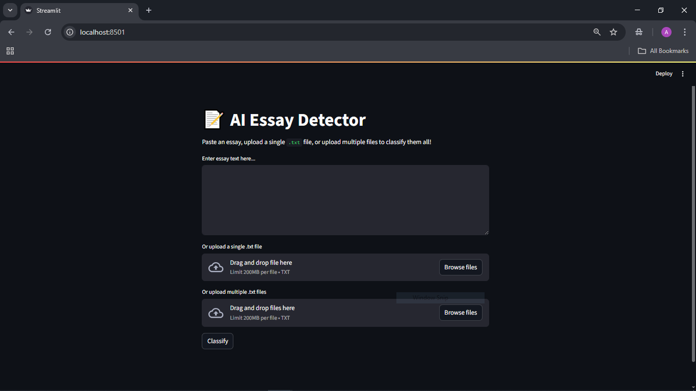
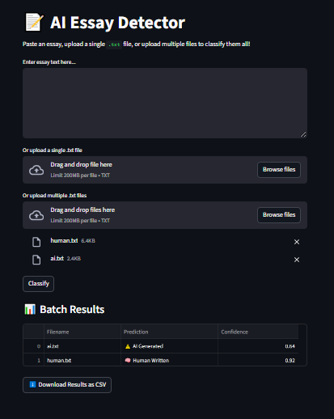

   # 📝 AI Generated Essay Detector

   A robust machine learning application to detect whether an essay is **AI generated** or **human written**. Built with Python, Scikit-learn, and Streamlit, this tool offers accurate, fast, and user friendly essay classification.

   ---

   ##  Features

   - **Accurate Classification:** Distinguishes between AI generated and human written essays.
   - **Multiple Input Methods:**
      - Paste text directly
      - Upload a `.txt` file
      - Batch classify multiple `.txt` files
   - **Confidence Scores:** Displays prediction probabilities for each essay.
   - **Batch Results:** Downloadable CSV of batch predictions.
   - **Intuitive UI:** Clean, modern interface powered by Streamlit.

   ---

   ##  Model Performance

   - **Accuracy:** 99%
   - **ROC-AUC:** 99%
   - Detailed evaluation (confusion matrix, classification report) available in `notebooks/ModelTrain.ipynb`.

   ---
   ## Screenshots

   
   
   


   ---
   ##  Try the Live Demo
[📝 AI Generated Essay Detector - Click to Test](https://aiessaydetector-ayaannadeem12.streamlit.app/)

---

   ##  Installation

   1. **Clone the repository:**
      ```bash
      git clone https://github.com/AyaanNadeem12/AIEssayDetector.git
      cd AIEssayDetector
      ```

   2. **Install dependencies:**
      ```bash
      pip install -r requirements.txt
      ```

   3. **Run the application:**
      ```bash
      streamlit run src/app.py
      ```

   > **Note:** Requires Python 3.8 or above.

   ---

   ##  Project Structure

   ```
   config.py
   data/
      balanced_ai_human_prompts.csv
   models/
      essay_detector.pkl
      tfidf_vectorizer.pkl
   notebooks/
      analysis.ipynb
      ModelTrain.ipynb
   src/
      app.py
   test_samples/
      ai.txt
      human.txt
   README.md
   requirements.txt
   ```

   ---

   ##  Tech Stack

   - **Python 3.8+**
   - **Pandas** – Data processing
   - **Scikit-learn** – Machine learning (Random Forest)
   - **Joblib** – Model serialization
   - **Streamlit** – Web application
   - **Matplotlib & Seaborn** – Data visualization

   ---

   ##  License

   This project is open-source and available under the [MIT License](LICENSE).

   ---

   ##  Contributing

   Contributions, issues, and feature requests are welcome! Please open an issue or submit a pull request.


